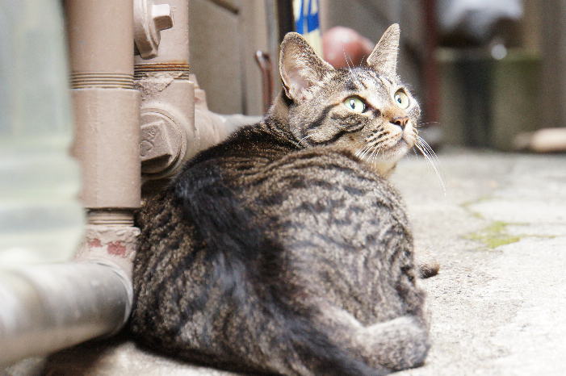
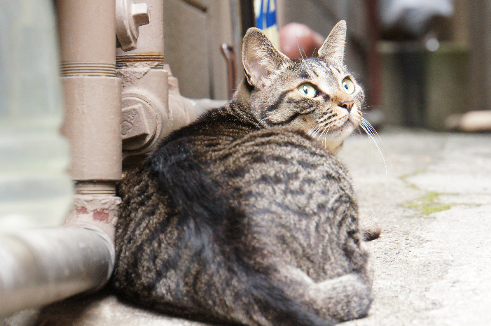
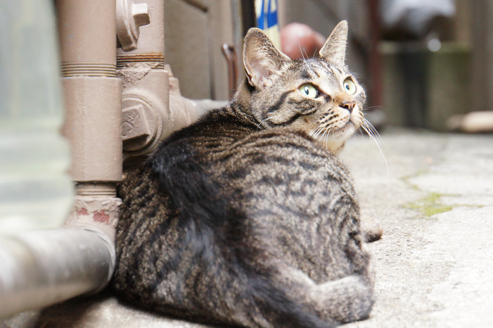

# Image Quality Preview

### NfntResizeNearestNeighbor

### NfntResizeBilinear

### NfntResizeBicubic

### NfntResizeMitchellNetravali

### NfntResizeLanczos2

### NfntResizeLanczos3

### GiftResizeNearestNeighbor

### GiftResizeLinear

### GiftResizeBox

### GiftResizeCubic

### GiftResizeLanczos

### MoustachioResample

### MoustachioResize

### RezConvertBilinear

### RezConvertBicubic

### RezConvertLanczos2

### RezConvertLanczos3

### GraphicsScale

### ImagingResizeNearestNeighbor

### ImagingResizeBox

### ImagingResizeLinear

### ImagingResizeHermite

### ImagingResizeMitchellNetravali

### ImagingResizeCatmullRom

### ImagingResizeBSpline

### ImagingResizeGaussian

### ImagingResizeBartlett

### ImagingResizeLanczos

### ImagingResizeHann

### ImagingResizeHamming

### ImagingResizeWelch

### ImagingResizeCosine

### DrawResizeNearestNeighbor

### DrawResizeApproxBiLinear

### DrawResizeBiLinear

### DrawResizeCatmullRom

### ImageMagickResize

### ImageMagickResizeWithDefine

